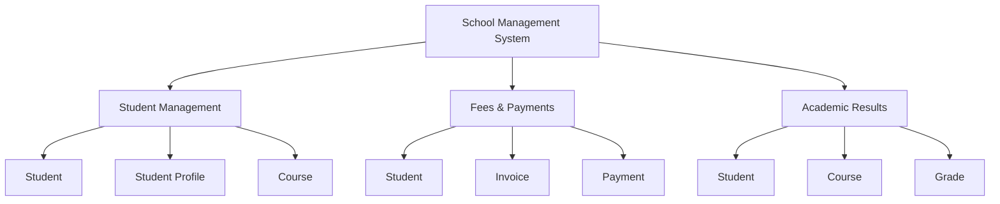

# School Management System

## 1. Domain Context Mapping

The school management system handles student records, course registration, and fee payments.

The system is divided into three bounded contexts:

### Student Management
- Student
- Student Profile
- Course

### Fees & Payments
- Student
- Invoice
- Payment

### Academic Results
- Student
- Course
- Grade

## 2. Domain Context Diagram

## 3. Student Management User Stories

### User Story 1: Update Student Profile

**As a student, I want to update my personal information so that my school records remain accurate.**

#### Acceptance Criteria

- **Given** a student is logged into the school management system,
- **When** the student updates their personal information and saves the changes,
- **Then** the system should update the student's profile,
- **And** display a confirmation message.

### User Story 2: Register for a Course

**As a student, I want to register for an available course so that I can enroll in the courses required for my program.**

#### Acceptance Criteria

- **Given** a student is eligible to register for courses,
- **When** the student selects an available course and confirms registration,
- **Then** the system should add the course to the student's registered courses,
- **And** display a registration confirmation.

## 4. Fees & Payments User Stories

### User Story 1: View School Fees

**As a student, I want to view my school fee invoice so that I can understand the amount I am required to pay.**

#### Acceptance Criteria

- **Given** a student has an outstanding school fee invoice,
- **When** the student opens the fees section,
- **Then** the system should display the invoice,
- **And** show the total amount due.

### User Story 2: Make Fee Payment

**As a student, I want to pay my school fees online so that I can complete my payment conveniently.**

#### Acceptance Criteria

- **Given** a student has an outstanding school fee balance,
- **When** the student selects a payment method and confirms the payment,
- **Then** the system should record the payment,
- **And** update the student's outstanding balance.

## 5. Academic Results User Stories

### User Story 1: View Grades

**As a student, I want to view my academic results online so that I can monitor my academic performance.**

#### Acceptance Criteria

- **Given** a student's grades have been published,
- **When** the student opens the results section,
- **Then** the system should display the student's grades,
- **And** show the corresponding courses.

### User Story 2: Download Academic Results

**As a student, I want to download my academic results so that I can keep a copy for my records.**

#### Acceptance Criteria

- **Given** a student's academic results have been published,
- **When** the student selects the download option,
- **Then** the system should generate a copy of the student's results,
- **And** allow the student to download it.
