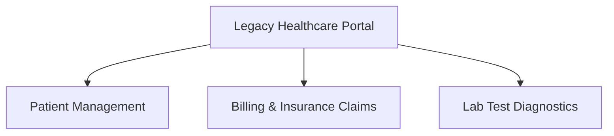

# Healthcare Portal Modernization

## 1. Domain Context Mapping

The legacy healthcare portal will be divided into three bounded contexts:

### Patient Management
- Patient
- Appointment
- Doctor

### Billing & Insurance Claims
- Invoice
- Payment
- Insurance Claim

### Lab Test Diagnostics
- Lab Test
- Test Result
- Patient

## 2. Patient Care User Stories

### User Story 1

**As a patient, I want to book an appointment online so that I can schedule a consultation conveniently.**

#### Acceptance Criteria

- **Given** a patient is logged into the healthcare portal,
- **When** the patient selects an available appointment time and confirms the booking,
- **Then** the system should create the appointment and display a confirmation message.

### User Story 2

**As a patient, I want to reschedule my appointment so that I can choose a different appointment time when my plans change.**

#### Acceptance Criteria

- **Given** a patient has a scheduled appointment,
- **When** the patient selects a new available appointment time,
- **Then** the system should update the appointment and display the updated appointment details.
